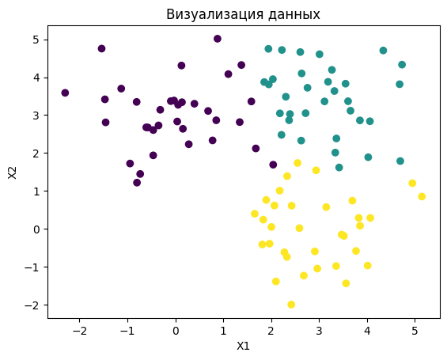
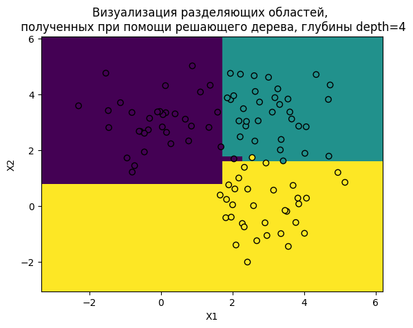
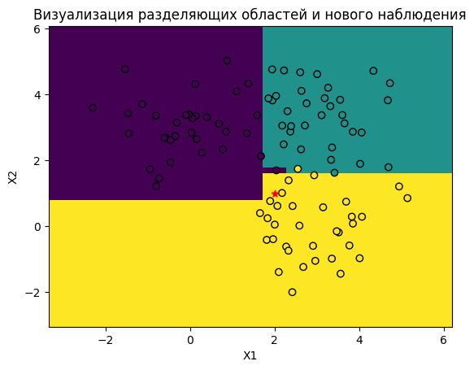
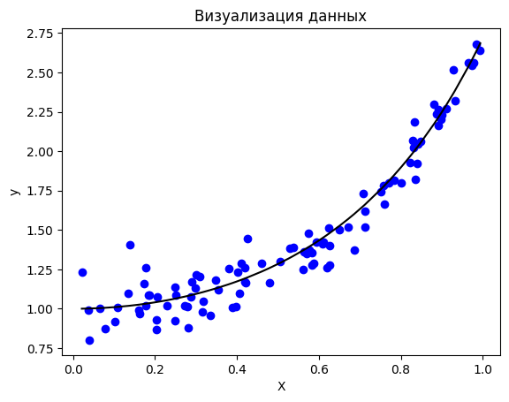
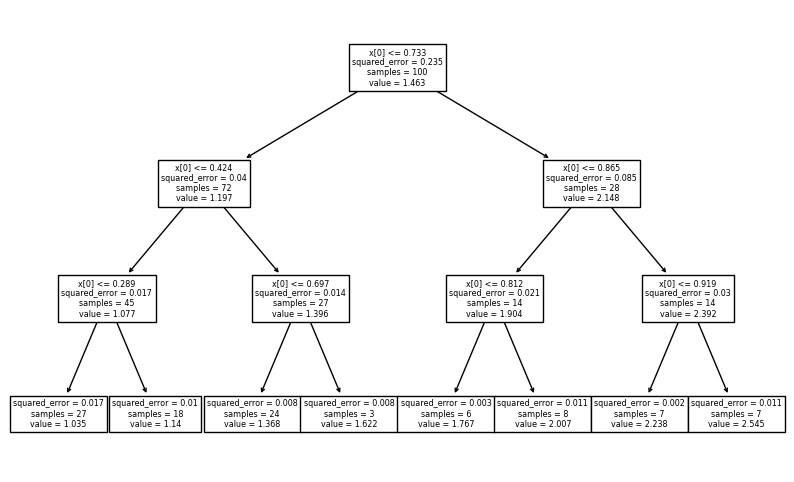
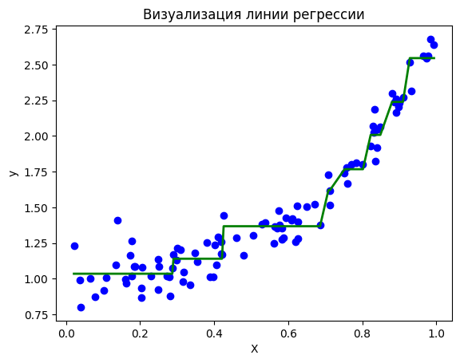

### Метод опорных векторов

#### Цель работы

Научиться применять модель дерева принятия решений для задач классификации и регрессии.

#### Содержание работы

1. Cгенерируйте данные для задачи классификации на три класса при помощи sklearn.datasets.make_blobs, содержащие два признака и 100 наблюдений. Визуализируйте их на диаграмме рассеяния.
1. Обучите модель классификационного решающего дерева sklearn.svm.DecisionTreeClassifier глубины 4 и критерием entropy.
1. Визуализируйте соответствующий граф дерева решений.
1. Визуализируйте полученные разделяющие области.
1. Оцените качество работы модели. Создайте новое наблюдение и сделайте предсказание на нём.
1. Cгенерируйте данные для задачи регрессии, содержащие один признак и 100 наблюдений, как случайный шум некоторой функции. Визуализируйте их на диаграмме рассеяния.
1. Обучите модель регрессионного решающего дерева sklearn.svm.DecisionTreeRegressor глубиной 3.
1. Визуализируйте соответствующий граф дерева решений.
1. Визуализируйте получившуюся кусочную линию регрессии.
1. Оцените качество работы модели. Создайте новое наблюдение и сделайте предсказание на нём.

#### Методические указания

##### Задача классификации

По аналогии с предыдущими работами, создадим и визуализируем датасет:

```py
X, y = make_blobs(n_samples=100, centers=[(0,3),(3,3),(3,0)], 
                                      n_features=2, random_state=RANDOM_SEED,
                                      cluster_std=(0.9,0.9,0.9))
plt.scatter(X[:, 0], X[:, 1], c=y)
plt.title('Визуализация данных')
plt.xlabel('X1')
plt.ylabel('X2')
```

Видим набор данных из трех классов:



Также, как и перцептрон, деревья решений могут легко применяться к задачам разной размерности. Количество классов не играет роли для дерева. Содадим и обучим модель:

```py
depth=4
clf_tree = DecisionTreeClassifier(criterion='entropy', max_depth=depth, 
                                  random_state=RANDOM_SEED)
clf_tree.fit(X, y)
```

Здесь мы задаем вид функции, которая будет использоваться для нахождения оптимальной границы разбиения выборки. По умолчанию используется критерий Джини, а мы сейчас будем использовать критерий информационной энтропии. Также мы задает максимальную глубину дерева. Дерево не будет "расти" дальше этого количества уровней. Вы самостоятельно можете изменить значения этих параметров и проанализировать, как это повлияет на рабоут модели.

После обучения данной модели мы можем вывести собственно само дерево решений, то есть полное внутреннее устройство модели. Для этого в объекте существует специальный метод _plot\_tree()_:

```py
tree.plot_tree(clf_tree) 
plt.show()
```

В этом объекте есть еще один метод визуализации дерева - втекстовом виде. Самостоятельно найдите и примените его. А использованный нами метод выводит дерево в графическом виде:


Проинтерпретируйте изображенную на этом графике информацию.

Теперь можно визуализировать сами границы принятия решений:

```py
X0 = np.linspace(X[:, 0].min()-1,X[:, 0].max()+1, X.shape[0])
X1 = np.linspace(X[:, 1].min()-1,X[:, 1].max()+1, X.shape[0])
X0_grid, X1_grid = np.meshgrid(X0, X1)

y_predict = clf_tree.predict(np.c_[X0_grid.ravel(),X1_grid.ravel()]).reshape(X0_grid.shape)
plt.pcolormesh(X0_grid, X1_grid, y_predict)

plt.scatter(X[:, 0], X[:, 1], c=y,  edgecolors='black',linewidth=1)

plt.title('Визуализация разделяющих областей, \n полученных при помощи решающего дерева, глубины depth={}'.format(depth))
plt.xlabel('X1')
plt.ylabel('X2')
plt.show()
```

Мы видим очень характерную для деревьев форму границы:



Как всегда оценим качество работы модели и с помощью метрик:

```py
y_pred = clf_tree.predict(X)
print(confusion_matrix(y, y_pred))
print('Accuracy =', accuracy_score(y, y_pred))
print('F1_score =', f1_score(y, y_pred, average='micro'))
```

```
[[34  0  0]
 [ 0 33  0]
 [ 0  1 32]]
Accuracy = 0.99
F1_score = 0.99
```


Мы видим, что модель допустила всего одну ошибку на 100 примерах, что довольно неплохо. Но увеличив глубину дерева можно еще повысить его эффективность и добиться абсолютной точности.

Теперь создадим новое наблюдение:

```py
observation_new = [[2, 1]]
```

И классифицируем его:

```py
clf_tree.predict(observation_new)
```

Визуализируем на графике его вместе с границей принятия решений:




##### Задача регрессии

Сгенерируем простой датасет для задачи регрессии. Для этого получим 100 упорядоченных случайных чисел, а затем значения целевой переменной вычислим как результат какой-нибудь функции (например возьмем экспоненту) и прибавим к результату случайный шум, для имитации разброса:

```py
n_samples = 100
X = np.sort(np.random.rand(n_samples))
y = np.exp(X ** 2)+np.random.normal(0.0, 0.1, X.shape[0])
```

Мы получим примерно такой датасет для парной регрессии (линия здесь добавлена только для информации и наглядности, она не является частью данных):



Создадим объект регрессора на основе деревьев решений и обучим его:

```py
depth=3
reg_tree = DecisionTreeRegressor(max_depth=depth, random_state=RANDOM_SEED)
reg_tree.fit(X, y)
```

Выведем полученное дерево:



Самостоятельно проинтерпретируйте информацию в этом графе. А мы построим линию регрессии на графике::

```py
plt.scatter(X, y, c="b")

plt.plot(X, y_pred_reg, "g", lw=2)

plt.title('Визуализация линии регрессии')
plt.xlabel('X')
plt.ylabel('y');
```

Опять видим характерную кусочно-линейную линию:



Тпереь как всегда оценим качество работы модели:

```py
print('r2= ', r2_score(y, y_pred_reg))
print('MSE= ', mean_squared_error(y, y_pred_reg))
```

```
r2=  0.9559340585697235
MSE=  0.010347452773751169
```

Данные метрики свидетельствуют о довольно точной работе модели. Лишь на графике открывается определенная условность и неглабкость полученных предсказаний. Давайте создадим новое предсказание:

```py
observation_new = [[0.7]]
```

И изобразим его на графике:


Самостоятельно подвигайте данную точку. Обратите внимание, что есть участки, где небольшое изменение положения точки не изменяет результат предсказания.

#### Задания для самостоятельного выполнения

1. Загрузите встроенные данные sklearn.datasets.load_iris, взяв только последние два столбца (длина и ширина лепестков). Изобразите их на диаграмме рассеяния, подкрасив каждый класс некоторым цветом.
1. Обучите модель классификационного дерева принятия решений sklearn.tree.DecisionTreeClassifier глубины 4, используя энтропию. Визуализируйте соответствующий граф дерева принятия решений.
1. Обучите модель классификационного дерева принятия решений sklearn.tree.DecisionTreeClassifier с разными глубинами (1, 2, 3, 4, 10), используя энтропию, и визуализируйте в каждом случае полученные разделяющие области.
1. Выведите необходимые метрики для оценки работы моделей с разными глубинами. Сделайте вывод о том, какая модель лучше классифицирует данные.
1. Загрузите весь датасет load_iris. Обучите модель классификационного дерева принятия решений sklearn.tree.DecisionTreeClassifier глубины 4, используя энтропию. Визуализируйте соответствующий граф дерева решений. Оцените качество работы модели.
1. Загрузите встроенные данные sklearn.datasets.california_housing, взяв только столбец AveBedrms в качестве единственного признака. Изобразите данные на диаграмме рассеяния так, чтобы на одной оси были отмечены значения признака, а на другой - целевой переменной.
1. Обучите модель регрессионного дерева принятия решений sklearn.tree.DecisionTreeRegressor, зафиксировав random_state=0, а остальными гиперпараметрами по умолчению.
1. Визуализируйте соответствующий граф дерева решений и получившуюся кусочную линию регрессии.
1. Оцените качество работы модели. Создайте новое наблюдение и сделайте предсказание на нём.
1. Загрузите весь датасет fetch\_california\_housing. Обучите ту же модель. Визуализируйте соответствующий граф дерева решений и оцените качество работы модели.


#### Контрольные вопросы

1. Почему граница принятия решений у деревьев решений имеет такую характерную форму?
1. Как глубина дерева влияет на сложность модели?
1. Почему глубина дерева на разных ветках может быть разная?
1. Что такое критерий в деревьях решений и как он влияет на работу модели?

#### Дополнительные задания

1. Проверьте работу модели на ненормализованных данных с очень разной величиной. Сделайте вывод о применимости модели дерева решений без нормализации
1. Примените дерево решений на большом датасете (не менее 10 000 строк и 10 столбцов) по вашему выбору.
1. Повторите моделирование с другим критерием. Найдите датасеты, на которых лучше работают разные критерии.
1. Используйте на первом датасете вместо деревьев решений случайный лес. Визуализируйте его границу принятия решений.

